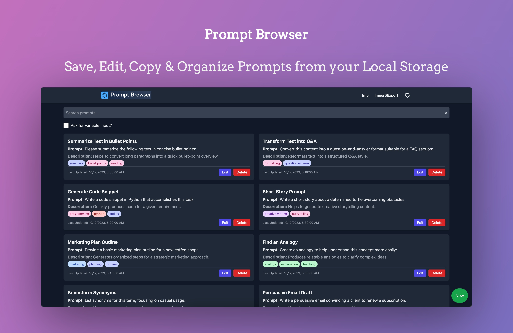

# Prompt Browser



Prompt Browser is a simple yet powerful web application for creating, editing, and organizing AI prompts. All data is stored locally in your browser, ensuring privacy and convenience. Built with simplicity in mind, Prompt Browser focuses on a clean user experience and minimal resource and setup requirements.

## Checkout the [Live Demo](https://prompts.shawon.me/)

## Why Prompt Browser?
- **Local Storage:** Your prompts never leave your browser.
- **Easy Management:** Create, edit, and copy prompts in a straightforward interface.
- **Intuitive Shortcuts:** Start typing to search prompts, double tap to copy, long tap to edit.
- **Clean & Lightweight:** Simple, distraction-free design to maximize productivity.

## Run with Docker
A pre-built Docker image is available at [`sharfy9/PromptBrowser:latest`](https://hub.docker.com/r/sharfy9/PromptBrowser).

### Using Docker Run
```bash
docker run -d \
  -p 8080:80 \
  --name prompt-browser \
  sharfy9/PromptBrowser:latest
```

Access the app at http://localhost:8080.

### Using Docker Compose
Create a docker-compose.yml with the following content:

```yaml
version: '3.8'
services:
  prompt-browser:
    image: sharfy9/PromptBrowser:latest
    container_name: prompt-browser
    ports:
      - "8080:80"
    restart: unless-stopped
```
Then run:

```bash
docker-compose up -d
```

That’s it! Your Prompt Browser instance will be available at http://localhost:8080. Enjoy your clutter-free AI prompt management!

[Learn more](https://shawon.me/projects/prompt-browser/).


